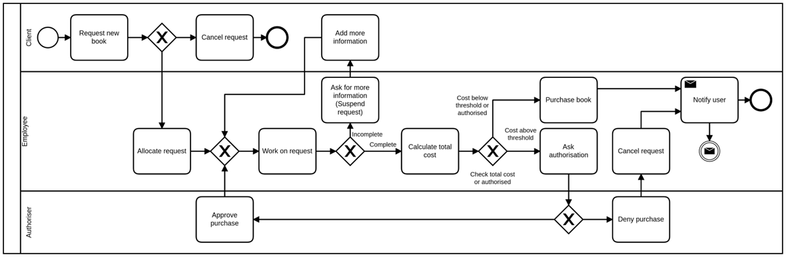

# Assessment Brief

## Case Study

ReadBooks Online (RBO) went through a significant expansion
in the past 10 years with ideas including adding the ability
for users to request books and audiobooks. Although IT
management is centralised in its head office, there are
several other employees elsewhere.

After a customer satisfaction survey, it was found that
substantial improvements could be made to their current
catalogue system. A survey was carried out to find current
customer trends and desires. The result of this is that any
client of RBO can request books or audiobooks not currently
in the RBO catalogue to be added for purchase.

This study resulted in a business process view of the
system, which is presented in Figure 1. This system is
security sensitive, only available to registered users and
the RBAC access control model is used to enforce security
policies within the organisation. In this context, the
catalogue editing process involves three roles: Client,
Employee and Authoriser.

A Client is any user who can register an account and can
subsequently request (audio)book(s) by opening a request
ticket.

An Employee is someone responsible for dealing with the
request.

An Administrator role, which comprises of an authoriser who
can monitor/create/delete employee and client accounts as
well as approving or denying requests.

_Figure 1: Request flow diagram of the proposed system_

As shown in the process diagram (figure 1), the process
starts with the client raising a ticket (Request new book).
New requests remain on a queue before being allocated to an
employee to be worked on. A client can cancel a request that
has not yet been allocated (Cancel request) - this caters
for accidental requests as well as requests the client is no
longer interested in. An employee can allocate a request to
themselves (Allocate request). Once a request is allocated,
an employee can process the request (Work on request) by
ensuring all relevant information for the book has been
submitted by the client. Requests with missing information
is sent back to the client to be updated (Ask for more
information) - the request will be suspended in this state
until missing information is added (Add more information)
and then automatically reallocated to the Employee that
asked for more information. While working on a complete
request Employees calculate the total cost of purchase
(Calculate total cost) and needs authorisation if it goes
beyond a configurable threshold. If the total value is above
the configured threshold, then the Employee needs an
authoriser (Ask authorisation) to approve (Approve purchase)
or deny (Deny purchase) the request. If the purchase value
is below the authorisation threshold, or it has been
authorised, the Employee can proceed with the purchase
(Purchase book). Clients are notified (notify user) if their
request is authorised or declined. Clients, employees and
authorisers should be able to see and search through a list
of requests; the clients should only be able to view their
own requests in this list.

Each one of these phases corresponds to a possible state a
request might be on the system. This is important because
the ReadBook Online management team is keen on being able to
obtain reports on the current status of the requests and be
able to measure some performance metrics.

Finally, it has been identified that a real time chat
function would greatly improve the system, with chat history
being saved and directly connected to a particular request.

## Task

You must build a system that can be used to manage purchase
requests. Your application must implement the
functionalities described below.

A prototype system for RBO to deal with purchase requests.
Your client wants a custom application that allows the
tracking of book purchase requests from a centralised
location.

For each purchase request the system needs to be able to
record information about who raised the request (the
client), details about the book and time/date information.
Requests information also includes the Employee user
allocated to it.

The system should also record the different change of states
a request goes through with their respective time/date
information and user that triggered the change. The states a
request can go through should follow the process diagram
description of the case study.

Employee users should be able to search for requests using
any of the above-mentioned information. Client users should
be able to list and search their own requests. Requests can
only be modified by the appropriate roles according to the
steps indicated in the process diagram. Users should be able
to see the different changes a request went through, while
maintaining the restriction that client users can only see
their own requests.

Optionally, client and employee users should be able to
communicate via a chatting system. Notice that the chat
system is a synchronous real-time communication channel,
different from the “Add more information” step in the
activity diagram which is asynchronous. Chats are associated
with a particular request.

You must build a system that can be used to manage purchase
requests. Your application must implement the
functionalities described below.

- Handle the creation and management of purchase requests
  and the information on them.
- Manage and track the change of status of purchase requests
  as well as controlling who can change a ticket based on
  its current status.
- Allow for client users to list, search and see details of
  their own requests.
- Allow for Employee and Authoriser users to list, search
  and see details of any request.
- Client and support users should be able to exchange
  messages through a chat system.
- Manage user authentication, sessions and access control.

In this task we require that you use JavaScript to
demonstrate the following aspects of the application:

1. An application that runs on the node.js server.
2. A data access layer that wraps a MongoDB database,
   presenting records and tuples as JavaScript objects in
   the form of JSON documents. This must implement a full
   set of CRUD operations.
3. A middleware layer that accepts HTTP requests (at least
   GET and POST), validates those requests and routes them
   to the appropriate URL endpoints.
4. A front-end layer that implements views using a framework
   such as Vue, React or Angular.
